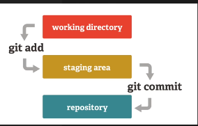
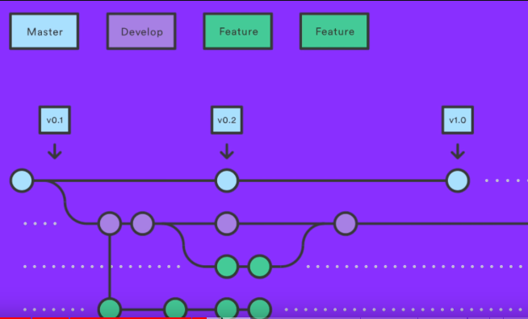

# Git Learning Notes

*Starting With Git*

Commands To start with are:

1. **git config --global user.name " "**
2. **git config --global user.email " "**
3. **git config --global --edit** //*can edit the file containg the username and email*

<!----Images---->

To add a change: **git add file_name**

To commit something: **git commit -m "some text**

*you can list how many braches are there with*

* Command: "**git brach**" // by deafult there is brach named master

*create a brach with "**git branch**" to go that branch// initally there is one branch //*</name>

*Can jump from one brach to other by using*

* Command: "**git checkout** <hash of that branch name or branch name> "

To Create and directly Jump to that brach

* Command:**git checkout -b** <name> here name=dinesh/feature // the best pratice is name_of_user working on that specific feature like dinesh/multiply

Inorder to add changes commited by devlopers (dev) to any branch or inoder to merge any branch with other

* First checkout to brach in which the other brach you want to be merged inside of this branch

Command : "**git merge** <branch name>"

Inorder to push branches to main branch

1. **git checkout main**

2.**git push**

"**.gitignore**" anything written this file git will not expose or track that

*Credits*: [Anju Bhaiaya](https://www.youtube.com/watch?v=uaeKhfhYE0U)